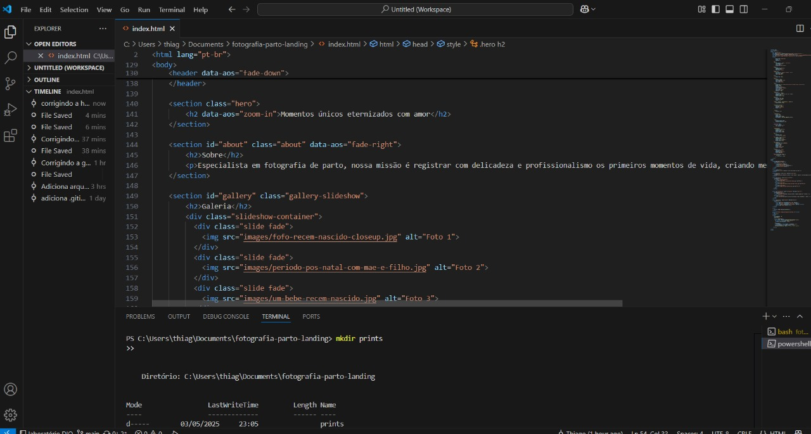
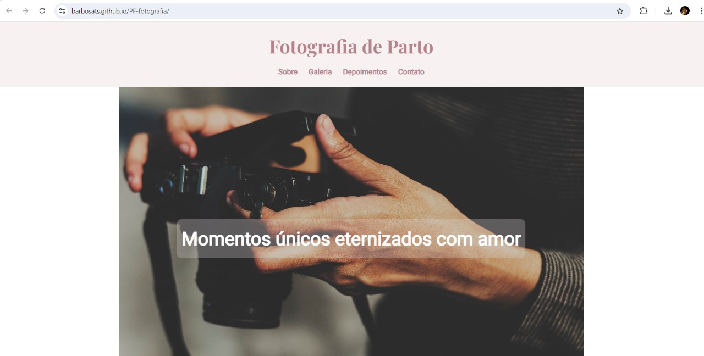
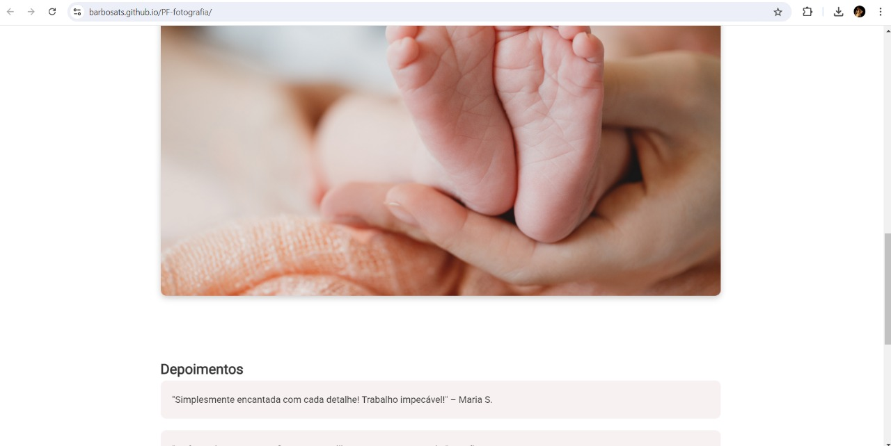

# Fotografia de Parto - Landing Page

Este projeto é uma landing page responsiva desenvolvida com HTML, CSS e JavaScript para com inspiração no trabalho de fotografia de parto da **Patricia Fornazier** (minha esposa).

## ✨ Funcionalidades
- Layout responsivo
- Animações com AOS
- Slideshow automático de imagens
- Seções: Sobre, Galeria, Depoimentos e Contato

## 🧠 Aprendizados
- Organização de estrutura HTML5
- Estilização com CSS moderno e responsivo
- Animações com AOS.js
- Implementação de carrossel (slideshow)
- Publicação com GitHub Pages

## 📸 Prints do Projeto






## 🚀 Publicação
O projeto está disponível em:  
🔗 https://barbosats.github.io/PF-fotografia/

## 💻  Para rodar localmente
1. Clone o repositório:
```bash
git clone https://github.com/barbosats/PF-fotografia.git